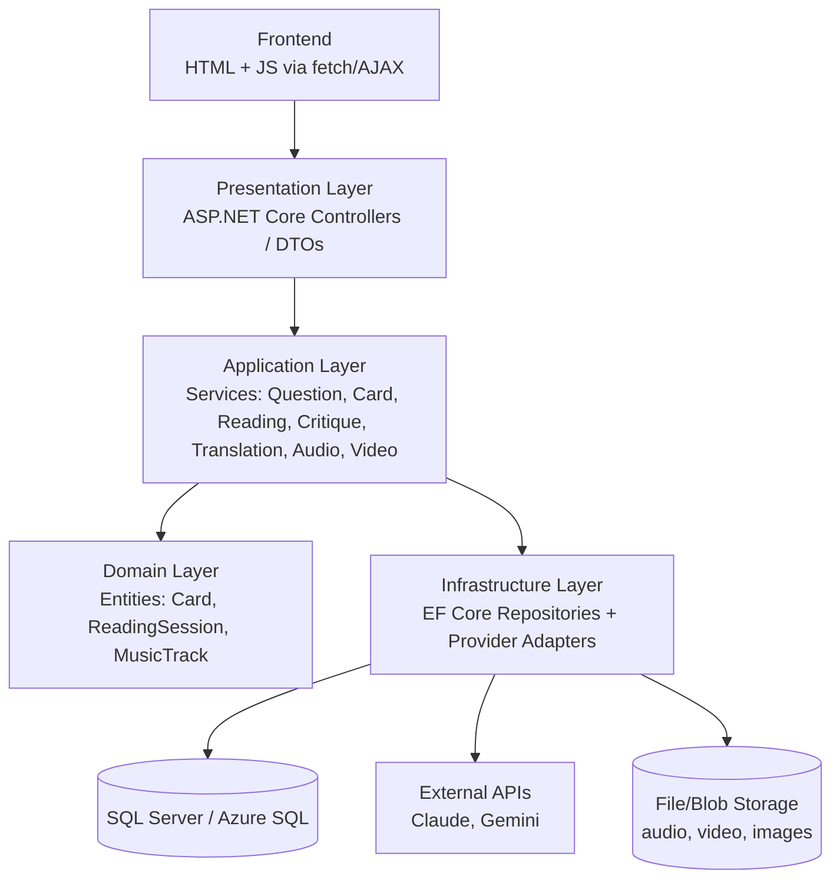

# Tarot Video Generator — Requirements for Enterprise Rebuild

2026-09-20 · @Someone

## 1. Project Goal & Context

Rebuild the existing Python proof-of-concept as a multi-layer enterprise application on the Microsoft stack (ASP.NET Core, Entity Framework, SQL Server/Azure), with real frontend/backend separation and a database instead of flat files.

Goal is explicitly learning: the POC proved the pipeline logic works end-to-end; this rebuild applies enterprise architecture patterns (layered architecture, DTOs, repository pattern, REST API design) to something already understood functionally.

What the POC validated, functionally complete:

- Generate a tarot question (manual or AI-agent-generated)
- Draw a card (random or specific) from a custom 78-card AI-generated deck
- Generate a mystical reading interpreting the card for the question (Claude API)
- Get AI critique on the reading before proceeding (on-demand)
- Translate the full narration into other languages (English, Ukrainian, Spanish)
- Generate narrated audio (Gemini TTS)
- Transcribe audio for word-level caption timing (Gemini transcription)
- Composite a vertical video: card image, background music, word-synced captions
- Review and regenerate at each stage before committing to the next (human-in-the-loop gates)

The new project should preserve this functional behavior while replacing the implementation with layered, database-backed architecture.

## 2. Functional Requirements (technology-agnostic)

The pipeline has nine stages, each with a human review/redo gate before committing to the next:

1. **Question input** — user types a question directly, or requests an AI-generated one (goal-directed: "pick a broadly relatable question, avoid repeating recent ones"). Editable either way before proceeding. System tracks recently-used AI-generated questions to avoid repetition.
2. **Card selection** — random draw or user-specified, from a deck of 78 cards. Each card carries: name, arcana type, upright meaning, reversed meaning, scene description, image reference.
3. **Reading generation** — AI generates a short mystical interpretation combining the card's meaning with the specific question asked.
4. **Critique (on demand)** — AI reviews the question, intro, and reading together; returns a verdict (good / minor tweaks / needs rework), a critique explanation, and a suggested fix. Not a blocking gate — invoked only when the user wants feedback.
5. **Narration assembly** — combine viewer-facing intro line + explicit question + card name + reading + fixed closing call-to-action into one narration script.
6. **Translation** — translate the full narration into a target language (English, Ukrainian, Spanish in the POC), preserving tone.
7. **Voice synthesis (TTS)** — generate narrated audio from the translated script. Pacing/tone controlled via descriptive instruction (e.g. "natural, brisk pace, mystical and calming"), not a numeric parameter.
8. **Transcription** — transcribe the generated audio to get word-level timestamps, used to sync on-screen captions exactly to speech.
9. **Video composition** — vertical (1080×1920) video: static card image background, optional licensed background music (looped/trimmed to length, faded in/out, mixed at low volume under narration), rolling word-synced captions in a styled semi-transparent box.

Each stage's output must be editable/regeneratable independently before moving to the next, and the two most expensive stages (audio, video) should sit behind explicit confirmation gates so redoing earlier text stages doesn't waste compute.

## 3. External Integrations

| Provider | Used for | Notes |
| --- | --- | --- |
| Anthropic Claude API | Reading generation, translation, question-agent (structured/tool-use output), critique-agent (structured/tool-use output) | Model names change frequently; treat as configuration, not hardcoded strings |
| Google Gemini API | Text-to-speech synthesis; audio transcription with word-level timestamps | TTS tone/pace is steered via natural-language prompt phrasing, not a numeric parameter |
| Suno (music generation) | Background music tracks | Commercial/YouTube-monetization rights depend on the subscription tier active *at the time each track was generated* — free-tier output stays non-commercial even after upgrading. Track provenance (tier at generation time) should be recorded per file. |

**Architectural implication:** since provider model names and API shapes change often (confirmed repeatedly during the POC), the new system should wrap each provider behind an interface (e.g. `IReadingGenerator`, `ITextToSpeechService`, `ITranscriptionService`) with a concrete adapter implementation — not call provider SDKs directly from business logic. This is standard Dependency Inversion and pays for itself specifically because these integrations are volatile.

## 4. Data Model

| Entity | Key fields | Notes |
| --- | --- | --- |
| Deck | Id, Name, StyleDescription | A deck is a themed set of 78 cards (e.g. the POC's Ukrainian-collage deck) |
| Card | Id, DeckId (FK), Name, Arcana, UprightMeaning, ReversedMeaning, SceneDescription, ImageRef | One row per card, scoped to a deck |
| ReadingSession | Id, CreatedAt, Question, ViewerIntro, CardId (FK), ReadingText, Language, NarrationText, CritiqueVerdict, CritiqueNotes, AudioRef, VideoRef, MusicTrackId (FK), Status | The central record — one row per generated video, replacing the POC's timestamp-named flat files |
| MusicTrack | Id, FileRef, DisplayName, SourceTier (e.g. Suno-Paid, Suno-Free, AudioLibrary), LicenseNote | Tracks provenance for commercial-use compliance |

**Question history / anti-repetition:** rather than a separate history file (as in the POC), this can be derived by querying recent `ReadingSession.Question` values and feeding them to the question-generation prompt — the database becomes the source of truth instead of a side file.

**Not needed yet, flagged for later:** a User/Channel entity is only necessary if this becomes multi-user or multi-channel. Keep out of the initial schema unless that's already a known requirement.

## 5. Proposed Enterprise Architecture

Classic layered ASP.NET Core structure, each layer depending only on the one below it:

**Layer responsibilities:**

- **Presentation** — thin controllers; map HTTP request to DTO, call a service, return a DTO. No business logic here.
- **Application** — one service per pipeline stage, holding the business logic currently in the POC's Python modules (`ai_text.py`, `voice.py`, `video.py`, `question_agent.py`, `critique_agent.py` map fairly directly to service classes).
- **Domain** — plain entity classes (Card, ReadingSession, MusicTrack) with no framework dependencies.
- **Infrastructure** — EF Core `DbContext` + repositories, plus adapter classes implementing the provider interfaces from Section 3 (Claude client, Gemini client).
- **DTOs** — request/response contracts per endpoint, validated via data annotations or FluentValidation — the same role Pydantic schemas played in the POC's FastAPI exploration.

**Cross-cutting concerns:** structured logging (e.g. Serilog), configuration via `appsettings.json` + a secrets store (Azure Key Vault or user-secrets locally) for API keys, dependency injection via the built-in ASP.NET Core container.

**Hosting target:** Azure App Service (API), Azure Blob Storage (generated media), Azure SQL Database (data) — matches the author's existing SQL Server background and stated interest in cloud environments.

## 6. Lessons Learned from the POC

- **TTS pacing is prompt-driven, not parameter-driven.** Gemini TTS has no numeric speed control — pace comes from descriptive instruction text ("natural, brisk pace"). Keep this instruction configurable rather than hardcoded.
- **Caption text boxes need fixed height with padding**, not auto-sized-to-content. Auto-sizing tightly cropped descenders (y, g, p) in the POC; giving the text render canvas a fixed height with margin fixed it.
- **Tool/structured-output field order matters.** When an LLM call returns multiple fields via structured output, put the fields you actually need before optional/verbose ones (e.g. a long "reasoning" field) — token limits can truncate generation before later fields are produced. Budget `max_tokens` generously for anything with free-text fields.
- **Verify third-party model/API names before using them** rather than relying on training data — provider model names changed under us multiple times during the POC and caused otherwise-avoidable runtime errors.
- **Human review gates belong right before the expensive steps** (audio synthesis, video render), not scattered arbitrarily — keeps the cost of redoing a text-stage decision near zero.
- **Keep deterministic steps as plain code; reserve AI agents for genuine judgment calls.** Video composition, image resizing, audio mixing are mechanical — wrapping them in an agent adds cost and unpredictability for no benefit. Question selection and quality critique are real judgment calls — that's where agents earned their place.
- **Background music licensing must be tracked per-track**, since commercial-use rights depend on the subscription tier active when a given track was generated, not the tier active later.

## 7. Open Questions for the New Project

- [ ] Single-user personal tool, or designed for multiple users/channels from the start? Determines whether a User/Channel entity belongs in the initial schema.
- [ ] File storage: local disk (simplest, matches POC) vs. Azure Blob Storage (more realistic for a genuinely deployed system)?
- [ ] Should video rendering run synchronously inside the API request, or as a background job/queue with a status-polling endpoint? Rendering takes real time — this is a natural place to introduce a common enterprise pattern (message queue + background worker) if that's a pattern worth learning here.
- [ ] Authentication: needed at all for a personal tool, or deferred until multi-user is an actual requirement?
- [ ] Deployment target: Azure App Service vs. local IIS vs. containerized (Docker)?

## 8. Source Control (Git / GitHub)

The POC now has Git/GitHub set up (github.com/JustLearning13/tarot-shorts), added retroactively after the fact — including one near-miss where \`.env\` and generated output files got committed before \`.gitignore\` was in place, caught and fixed before pushing. The rebuild should carry the same discipline from the very first commit instead: \`.gitignore\` created \*before\* the first \`git add\`, not after.

**Baseline requirements:**

- Initialize a Git repository at project start, before any code exists — not retrofitted later.
- Push to a GitHub repository (public or private, author's choice) as the remote.
- A `.gitignore` appropriate for .NET: exclude `bin/`, `obj/`, `*.user`, and any `appsettings.*.json` file holding real API keys or connection strings — secrets never get committed, even to a private repo.
- Commit in small, meaningful increments tied to what was actually built (e.g. "Add Card entity and EF configuration"), not one giant commit at the end — the commit history itself becomes a second, practical lesson in the discipline alongside the architecture work.
- Use feature branches for each layer/slice of work (e.g. `feature/card-api`, `feature/question-agent-service`), merged via pull request even when working solo — this is standard practice worth building as a habit, and PRs give a natural checkpoint to review one's own code before merging.

**Stretch goal, tied to the cloud-environment interest already in this project:** once the API is stable, a GitHub Actions workflow that builds and deploys to Azure App Service on push to `main` — a first real taste of CI/CD, a natural extension of everything else in this document.
